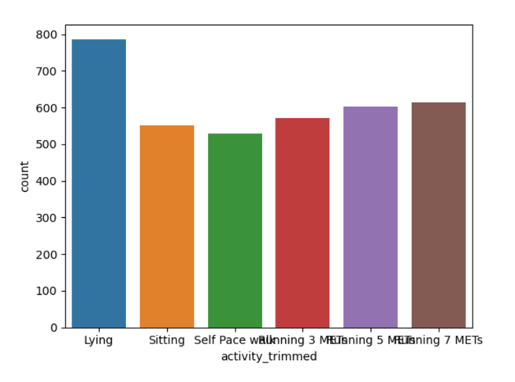

# Apple Watch Health Data Ethics & Bias Analysis
# Executive Summary:
The Apple Watch has evolved into a powerful health‑monitoring device capable of collecting continuous biometric and behavioral data, including heart rate, sleep cycles, physical activity, and oxygen levels. These capabilities enable personalized health insights and early detection of medical issues, but they also introduce significant ethical concerns around privacy, informed consent, and data governance. As wearable devices become more integrated into daily life, the boundary between health monitoring and surveillance becomes increasingly blurred.

This project evaluates Apple’s health data collection practices through both technical and ethical lenses. Using a dataset from a controlled laboratory study, the analysis examines data quality, outliers, skewed distributions, and demographic imbalances that may influence algorithmic performance. Ethical frameworks—including Kantianism, Act Utilitarianism, and Rule Utilitarianism—are applied to assess Apple’s responsibilities regarding transparency, fairness, and user autonomy.

The findings reveal that while Apple Watch data can support meaningful health insights, it also carries risks related to algorithmic bias, third‑party access, commercialization of sensitive information, and long‑term psychological impacts. Recommendations emphasize improving meaningful consent, strengthening data security, increasing transparency, and adopting fairness‑oriented modeling practices to ensure that wearable technologies support public health without compromising user rights.

# Business Problem:
Wearable devices like the Apple Watch collect vast amounts of biometric data with minimal user intervention. While this data can improve health outcomes, it also creates a complex ecosystem where users often lack the knowledge or capacity to manage their privacy effectively. Consent agreements are lengthy, opaque, and difficult to interpret, leaving users unaware of how their data is collected, processed, or shared. This creates a gap between user expectations and actual data practices.

From a business and societal perspective, the reliability and fairness of health‑related algorithms are critical. If the underlying data is biased or unbalanced, predictive models may misclassify activity levels or physiological states, leading to inaccurate health insights or discriminatory outcomes. Companies like Apple must balance innovation with ethical responsibility, ensuring that data collection, processing, and algorithmic decision‑making are transparent, equitable, and aligned with user rights. 

# Methodology:
• 	Conducted a full structural audit of the dataset, checking for missing values, duplicates, and anomalies.

• 	Performed exploratory data analysis using histograms, boxplots, and distribution plots to identify outliers and skewed variables.

• 	Evaluated demographic and activity‑level imbalances, including gender distribution and class imbalance across activity categories.

• 	Applied winsorization (1st–99th percentile) to reduce the influence of extreme sensor spikes while preserving physiological ranges.

• 	Implemented a reweighting‑based resampling technique to address intersectional bias without generating synthetic physiological signals.

• 	Assessed ethical implications using Kantianism, Act Utilitarianism, and Rule Utilitarianism.

• 	Documented transparency measures, including feature provenance, preprocessing decisions, and fairness considerations.

# Skills:
• 	Data quality auditing and preprocessing

• 	Exploratory data analysis and visualization

• 	Bias detection and fairness‑oriented resampling

• 	Ethical reasoning and data governance analysis

• 	Interpretation of wearable‑sensor data

• 	Documentation and transparency practices

• 	Python (pandas, numpy, matplotlib, seaborn)

• 	Jupyter Notebook workflow

# Results and Recommendations:
Data Quality & Distribution Findings

• 	No missing or duplicate records were found.

• 	Steps and distance variables contained >10% outliers, likely due to activity transitions.

Visualization: Outlier Concentration
<h3>Outlier Concentration</h3>

Steps × Distance Histogram
<h3>Steps × Distance Histogram</h3>

• 	Heart rate distributions were bimodal, reflecting rest vs. exertion states.

Example Visualization: Heart Rate by Gender
<h3>Heart Rate by Gender</h3>

• 	Derived metrics (entropy, correlation) showed narrow ranges due to internal smoothing.

Visualization: Activity Distribution
<h3>Activity Distribution</h3>

Bias & Imbalance Findings

• 	“Lying” activity dominated the dataset, creating label imbalance.

• 	Gender imbalance (26 women, 20 men) contributed to intersectional bias.

• 	Women were overrepresented in low‑movement states, while men appeared more often in higher‑intensity activities.

Recommendations

• 	Improve meaningful consent through progressive disclosure and simplified language.

• 	Strengthen data security with end‑to‑end encryption and independent audits.

• 	Enforce strict third‑party data contracts to prevent unauthorized sharing.

• 	Publish transparency reports detailing data usage, retention, and algorithmic impacts.

• 	Adopt fairness‑oriented modeling practices, including reweighting and demographic reporting.

• 	Maintain reproducible preprocessing logs and model cards for accountability.

# Next Steps:
1. 	Develop a reproducible code pipeline including a full preprocessing log, reweighting script, and model evaluation notebook.

2. 	Create a model card or dataset factsheet summarizing demographic composition, preprocessing steps, and fairness considerations.

3. 	Extend the analysis to real‑world Apple Watch datasets (if available) to compare laboratory findings with naturalistic user behavior.
