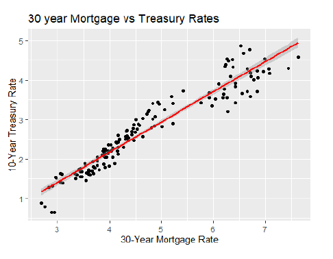
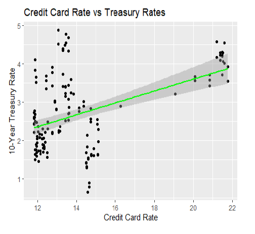
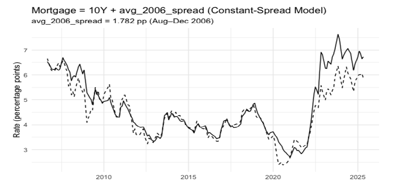

# How-Do-Treasury-Rates-Affect-You?
# Executive Summary:
Movements in the U.S. 10‑year Treasury yield play a central role in shaping consumer borrowing costs across the financial system. Because the 10‑year Treasury is considered a near risk‑free benchmark, lenders use it as a foundation for pricing long‑term credit products such as mortgages, commercial loans, and auto loans. This project analyzes nearly two decades of monthly data (August 2006–April 2025) to measure how strongly Treasury yields correlate with consumer lending rates and to determine which loan types are most sensitive to Treasury movements.

The analysis includes correlation testing, multivariate regression, outlier diagnostics, and assumption checks to ensure statistical validity. Secured lending products—especially 30‑year mortgages (r = .96) and commercial 504 loans (r = .93)—showed the strongest relationships with Treasury yields. Unsecured products such as credit cards (r = .47) and Stafford loans (r = .68) demonstrated weaker or negative coefficients due to risk premiums, regulatory formulas, and annual rate resets. A refined regression model explained 94% of the variance in Treasury yields, confirming the Treasury’s role as a macroeconomic driver.

These findings have practical implications for lenders, policymakers, investors, and consumers. Treasury movements influence mortgage pricing, credit market activity, refinancing decisions, and broader economic conditions. Understanding these relationships helps stakeholders anticipate rate adjustments and make informed financial decisions.

# Business Problem:
Consumer lending rates affect millions of borrowers and play a major role in housing markets, credit markets, and overall economic activity. Yet most consumers—and even many business stakeholders—do not fully understand how benchmark Treasury yields translate into the interest rates they pay on mortgages, auto loans, personal loans, and credit cards. This creates a transparency gap that limits effective financial planning and risk management.

Financial institutions rely on Treasury yields to price long‑term lending products, but the strength of these relationships varies widely across loan types. Without a clear analytical understanding of these linkages, lenders may misprice risk, policymakers may misinterpret market signals, and consumers may make suboptimal borrowing decisions. This project addresses that gap by quantifying how strongly different lending products respond to Treasury movements and by identifying which loan types are most sensitive to macroeconomic shifts. 

# Methodology:
• 	Collected monthly data (2006–2025) for the 10‑year Treasury yield and six consumer lending rates.

• 	Conducted exploratory data analysis, descriptive statistics, and time‑series visualization.

• 	Performed outlier detection using Cook’s distance, leverage values, and Mahalanobis distance.

• 	Removed 13 extreme observations to stabilize the regression model.

• 	Verified regression assumptions: additivity, linearity, normality, homoscedasticity.

• 	Built a multivariate regression model predicting Treasury yields from loan rates.

• 	Applied backward elimination to retain only statistically significant predictors.

• 	Developed a constant‑spread benchmark model for mortgage rates to test predictive validity.

• 	Interpreted results in the context of financial markets, risk premiums, and regulatory structures.

# Skills:
• 	Correlation analysis and regression modeling

• 	Outlier detection and assumption diagnostics

• 	Time‑series visualization and interpretation

• 	Model refinement using backward elimination

• 	Financial analytics and interest‑rate modeling

• 	R programming (ggplot2, corrplot, psych, car, lmtest, dplyr)

• 	Data cleaning, normalization, and reproducibility practices

• 	APA‑style reporting and statistical communication

# Results and Recommendations:
Correlation Findings

• 	Mortgage rates (r = .96) and commercial 504 loan rates (r = .93) track Treasury yields most closely.

• 	Auto (r = .85) and personal loans (r = .87) show moderate sensitivity.

• 	Credit card APRs (r = .47) and Stafford loans (r = .68) show weak or negative coefficients due to risk premiums and regulatory formulas.

<h3>Visualization: Mortgage vs. Treasury</h3>

Regression Findings

• 	Final model R² = .94, indicating strong explanatory power.

• 	Significant predictors: 30‑year mortgage rate, credit card rate, 5‑year auto rate, commercial 504 rate.

• 	Negative coefficients for credit card and Stafford loans reflect pricing structures unrelated to Treasury movements.

<h3>Visualization: Credit Card vs. Treasury</h3>

Constant‑Spread Mortgage Model

• 	Mortgage ≈ Treasury + 1.782% (baseline spread)

• 	RMSE (Root Mean Squared Error) = 0.033, MAE (Mean Absolute Error) = 0.031

• 	Accurate overall, but spreads vary during market volatility.

<h3>Visualization: Constant‑Spread Model</h3>

Recommendations

• 	Lenders should monitor Treasury yields closely when pricing secured lending products.

• 	Policymakers should consider Treasury movements when evaluating consumer borrowing conditions.

• 	Consumers should expect mortgage and auto loan rates to move in tandem with Treasury yields.

• 	Investors can use Treasury trends as early indicators of housing and credit market activity.

# Next Steps:
1. 	Expand the model by incorporating macroeconomic indicators such as inflation, unemployment, and the Federal Funds Rate.

2. 	Apply time‑series methods (ARIMA, VAR) to capture lagged effects and structural breaks.

3. 	Explore machine learning models (Random Forest, Gradient Boosting) to capture nonlinear relationships and improve predictive accuracy.
